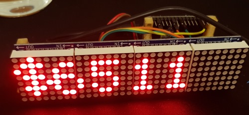

# Bitcoin price ticker with ESP8266

* **COMING SOON:** Working on STL file for 3D printed case, maybe switch to more compact ESP-12E/F!
* **NEW:** Dot Matrix LED Display support with 32x8px
* **NEW:** bitstamp & bitfinex websocket interfacing for real time updates!
* cheap components (total cost ~6 USD)
* no soldering required (order display with pre-soldered pin headers)
* low power (<0.5W)
* wifi + easy config with WifiManager captive portal

## pictures in action
  
v0.2-bitstamp-websockets in action ([gfycat link](https://gfycat.com/gifs/detail/VainBeautifulAcornwoodpecker))

  
v0.3 with dot matrix display

  
original prototype

## components
* ESP8266 Wemos D1 R2 Uno ([link](http://s.click.aliexpress.com/e/cN7TWnfi)) or ESP8266s/NodeMCUs ([link](http://s.click.aliexpress.com/e/bqhV6bqg))
* 7 segment display with MAX7219 ([link](http://s.click.aliexpress.com/e/7uottDW)) or Dot Matrix display ([link](http://s.click.aliexpress.com/e/Jckdk7Q))
* dupont cables (female-to-male) and maybe a cheap antenna ;)

## wiring 7-segment

ESP | Display
--- | ---
GND | GND
5V/VIN | VCC
D6  | CS
D7  | DIN
D8  | CLK

## wiring dot-matrix-display using hardware SPI

NodeMCU | Display
---     | ---
GND     | GND
5V/VIN  | VCC
D2      | CS
D5      | CLK
D7      | DIN

## how to install
- flash the board
  * upload source sketch with arduino IDE
  * or flash binary [(download)](https://github.com/nebman/btc-ticker-esp8266/releases) with [esptool (python)](https://github.com/espressif/esptool) or [flash download tools (WIN)](https://espressif.com/en/support/download/other-tools) @ address 0x0
- connect board to power 
- connect your smartphone/computer to ESPxxxxxx wifi
- enter your home wifi settings at the captive portal

## known issues

- compilation error in LedControl.h:  
solution: comment out or delete pgmspace.h include

## TODO

* ! correct level-shifting to 5V (3.3V is out of spec, but works anyway)
* ~~add 5th digit for next ATHs ;-)~~
* web portal configuration 
* ~~better error handling (although it seems to be pretty stable with good connection)~~
* ~~maybe use websockets for real-time ticker~~
* add more APIs and currencies plus option to choose
* ~~TLS support for HTTPS requests~~
* 3D printed case

